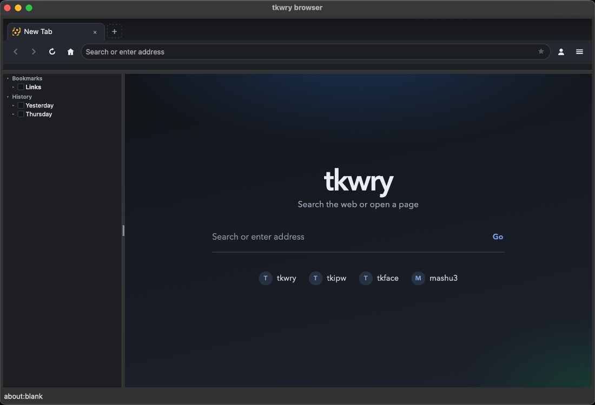
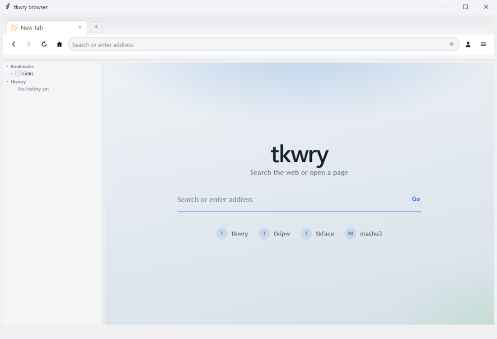

# Mini-browser example (`tkwry_browser.py`)

The flagship demo: a small multi-WebView browser built only with Tk + tkwry.
Start here if you want to see embedding, `app=` UI, RPC, sessions, and trust
boundaries working together in one app.

| macOS · dark | Windows · light |
|:---:|:---:|
|  |  |

```bash
python examples/tkwry_browser.py
python examples/tkwry_browser.py --private   # ephemeral content session
```

Requires **tkwry >= 0.1.8** (rebuild with `pip install -e .` if import or
version checks fail — a stale `_core.pyd` / `.so` is a common cause).

Single file: HTML/CSS/JS for the toolbar strip, side pane, and Settings are
embedded and written to a temp tree at startup, then loaded with `app=`
(keeps `tkwry://` origins — not `html=` for those UI surfaces).

## Layout

| Surface | Role | Session |
|---------|------|---------|
| **Toolbar** | Tabs, URL bar, back/forward/reload/home, profile + app menus | Own UI `WebSession` + RPC |
| **Side pane** | Bookmarks / history tree | Own UI `WebSession` + RPC |
| **Settings tab** | Home, search, downloads, profiles, cookies | Own UI `WebSession` + RPC |
| **Content tabs** | Real pages (and the New Tab start page) | Shared **content** `WebSession` |

UI `app=` roots must not share one `WebSession` (Linux registers `tkwry://`
once per context). Content stays on a **separate** session so browsing data
does not mix with toolbar / Settings cookies.

Tk owns the window menu bar on macOS/Linux (File / View / Help) and pop-up
context menus. Windows skips the native menubar and uses the toolbar hamburger
(in-app menu via RPC) instead. **Help…** shows the tkwry version and can open
the GitHub repository.

## What it exercises

- **Child embedding** — toolbar, side, and content share one Tk layout
  (`PanedWindow`, pack); bounds follow resize / tab switches
- **Local UI** — `app=` + CSP; Settings is fully local
- **RPC / emit** — toolbar and side call Python; Python pushes `state` / `ntp`
- **Trust split** — content uses `bridge_origins="*"` for link interception
  and a small clipboard bridge only (expect the security warning; see
  [Trust](trust.md))
- **New Tab** — `html=` start page (brand, search, bookmark shortcuts);
  Home `about:blank` selects that page; reload re-loads HTML (native
  `reload()` would clear `html=` documents)
- **Profiles** — named dirs under `~/.tkwry/`; switch / create / delete from
  Settings; `--private` uses an ephemeral content session. Default download
  folder is the OS **Downloads** directory (not under the profile tree)

## Shortcuts (demo)

Cmd/Ctrl bindings are installed with `bind_class` ahead of the macOS web
key-guard, plus a JS bridge so keys still reach Python while a WKWebView is
focused. Examples: new tab, reopen closed tab, tab cycle, zoom, focus the
URL bar, Settings.

Clipboard copy/cut/paste goes through Tk (`clipboard_get` / `clipboard_set`)
because WKWebView pasteboard access is unreliable for this demo.

## Not a product browser

This is an **example**, not a supported browser product. Prefer it as a
recipe for session split, toolbar RPC, and content policy — copy patterns,
not the whole file, into real apps.

## Related

- [Usage](usage.md) — `WebView`, `WebSession`, layout, navigation
- [Trust boundaries](trust.md) — why content uses `bridge_origins="*"` carefully
- [IPC / RPC / emit](rpc.md)
- [Platform notes](platforms.md) — macOS focus / DevTools / clip containers
- [Packaging notes](packaging.md) — PyInstaller / Nuitka ``.exe`` / ``.app`` samples
- [README — Examples](../README.md#-examples)
